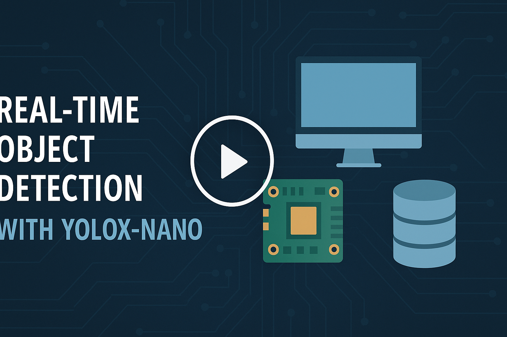
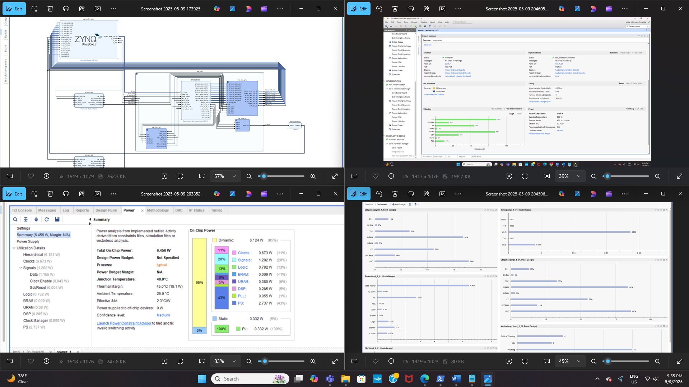
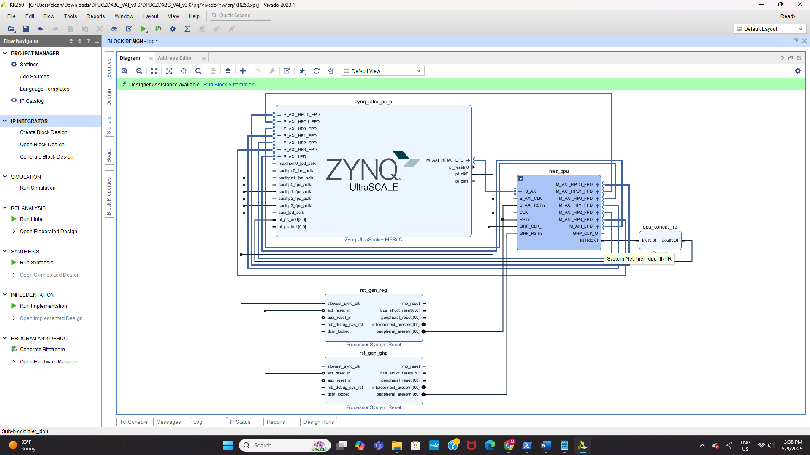
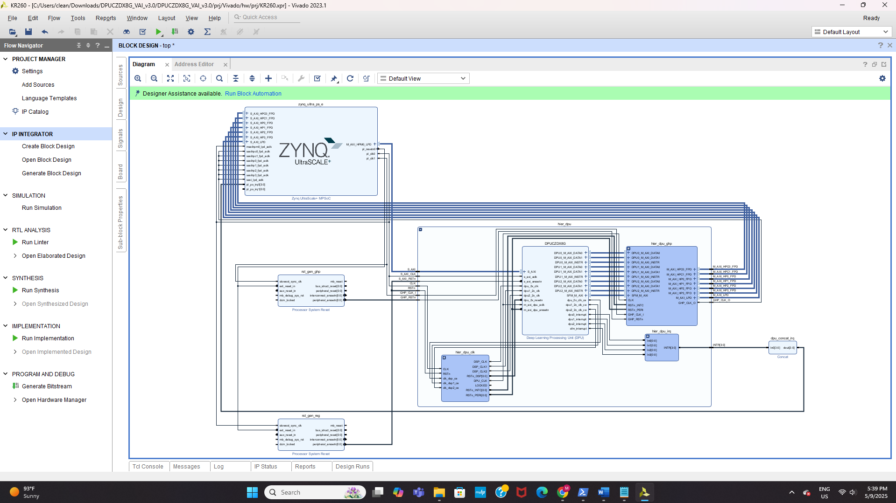
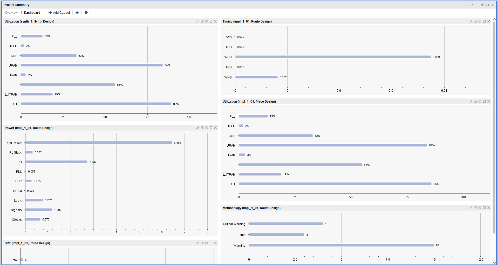

# Edge AI on Kria KR260: ResNet-50 & YOLOX

**Real-time deep learning on the AMD Kria KR260 with a custom DPU overlay. Runs ResNet-50 on PetaLinux and YOLOX-Nano on Ubuntu using DPU-PYNQ for robotic vision and edge inference.**

---

## Project Overview 🛠️

This project implements two edge AI workflows on the Kria KR260 platform using a custom B4096 DPU:

- **ResNet-50** classification on PetaLinux with Vitis AI 3.0  
- **YOLOX-Nano** object detection on Ubuntu with DPU-PYNQ 3.5 (Python)

Each pipeline demonstrates low-latency inference using shared DPU hardware.

---

## System Architecture 🧩

---

## Vivado DPU Design 🔧

The DPU overlay was created in Vivado 2022.2 with the B4096 architecture.

---

## Workflow Summaries 📌

### ResNet-50 on PetaLinux
- C++ application using VART API
- Uses precompiled ResNet-50 `.xmodel` from Vitis AI Model Zoo
- Inference on static images with ~0.2 ms per image
- Outputs top-5 class predictions with inference time

### YOLOX-Nano on Ubuntu
- Python-based object detection pipeline using DPU-PYNQ 3.5
- Real-time webcam inference at 10–20 FPS
- Frame preprocessing, DPU execution, and post-processing with OpenCV + GStreamer
- Displays bounding boxes and class labels in real-time

---
## Folder Structure 🗂️
- `vivado_project/`: DPU.xsa, DPU.bit, dpu.hwh
- `petalinux_resnet/`: shell.json, dpu-trd-b4096.bit.bin,kr260.dtbo,petalinux-sdimage.wic.gz
- `ubuntu_yolox/`:real_time_yolox_nano_pt_usb_camera.py, coco2017_classes.txt,yolox_nano_pt.xmodel, dpu.xclbin, dpu.hwh
- `images/`: Architecture diagram, screenshots, project PDF

## Future Work 🔭

- Combine classification and detection into a single pipeline  
- Add support for other models: YOLOv5, MobileNet, segmentation  
- Develop a web-based or GUI dashboard for real-time monitoring  
- Extend deployment to robotics, drones, or surveillance systems  

---

## References 🔗

- [Vitis AI Documentation](https://xilinx.github.io/Vitis-AI/)
- [DPU-PYNQ GitHub](https://github.com/Xilinx/DPU-PYNQ)
- [Kria Robotics Starter Kit](https://www.amd.com/en/design/kria/kr260-robotics-starter-kit.html)
- [AMD-Pervasive-AI-Developer-Contest](https://github.com/iotengineer22/AMD-Pervasive-AI-Developer-Contest/)
